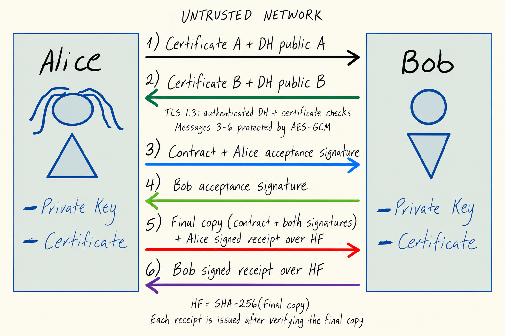

# Secure Electronic Contract Signing (SECS)

## 1. Security goals

The SECS system must provide four main security goals:

1. Non-repudiation of origin: Neither Alice nor Bob can credibly deny signing the contract.
2. Non-repudiation of receipt: Neither Alice nor Bob can credibly deny receiving the final copy containing both signatures.
3. Integrity: modifications to the contract must be detected.
4. Confidentiality: the contract terms must not be readable by a network attacker while they are transmitted.

The design assumes Alice and Bob are communicating over a network that may be controlled or observed by an attacker.

---

## 2. Cryptographic primitives

### Digital signatures

Alice and Bob each have a public/private signing key pair and a certificate issued by a trusted Certificate Authority (CA).

Alice uses her private signing key to sign the contract hash and relevant protocol information. Bob uses Alice's public key from her certificate to verify the signature.

Bob also signs the contract to express acceptance, not just receipt. Both parties then sign separate receipts for the final copy containing both contract signatures. We use RSA signatures over SHA-256, as illustrated in the week-5 notebook; its small demonstration keys are not suitable for a real system.

Digital signatures are used for non-repudiation and authentication because only the holder of the corresponding private key should be able to create a valid signature.

### Hashing

A cryptographic hash such as SHA-256 is used to calculate a digest of the contract:

`contract_hash = SHA-256(contract)`

The hash is included in the signatures instead of signing the entire contract directly. If any part of the contract changes, its hash will change and the signature verification will fail.

The hash of the final copy, including both signatures, is included in each receipt so that both receipts refer to exactly the same final copy.

### Authenticated key exchange

Alice and Bob establish a shared session key using an authenticated Diffie-Hellman key exchange.

Their public keys are authenticated using their CA-issued certificates. The resulting shared secret is used to derive a symmetric encryption key.

This provides confidentiality without requiring Alice and Bob to exchange a symmetric key directly over the network.

### Authenticated encryption

The contract is encrypted using an authenticated encryption scheme such as AES-GCM.

AES-GCM provides confidentiality and integrity for the encrypted contract, provided that a nonce is never reused with the same key.

The nonce is transmitted together with the ciphertext because the nonce does not need to be secret.

### PKI

A trusted Certificate Authority binds each participant's identity to their public key.

Alice and Bob verify the certificates before using the corresponding public keys. Certificate validation includes checking that the certificate is trusted, valid, and associated with the expected identity.

---

## 3. Message flow

The following protocol assumes an attacker can observe, modify, replay, or inject network messages.

```text
                         UNTRUSTED NETWORK
        =====================================================

 Alice                                                     Bob
   |                                                         |
   |  1. Certificate_A + DH_public_A + contract metadata    |
   |-------------------------------------------------------->|
   |                                                         |
   |                         2. Certificate_B + DH_public_B |
   |<--------------------------------------------------------|
   |                                                         |
   |  TLS 1.3 authenticates DH and both parties.              |
   |  Both validate certificates and establish session keys.  |
   |                                                         |
   |  3. Encrypted contract + nonce +                       |
   |     Alice signature over contract hash + metadata       |
   |-------------------------------------------------------->|
   |                                                         |
   |                         Bob decrypts and verifies:       |
   |                         - AES-GCM authentication         |
   |                         - Alice's certificate            |
   |                         - Alice's signature              |
   |                         - contract hash                  |
   |                                                         |
   |                         4. Bob signs the contract        |
   |<--------------------------------------------------------|
   |  Alice verifies Bob's acceptance signature.              |
   |                                                         |
   |  5. Final copy with both signatures + Alice's            |
   |     signed receipt over the final copy's hash            |
   |-------------------------------------------------------->|
   |                         Bob verifies the final copy.    |
   |                                                         |
   |                         6. Bob's signed receipt          |
   |                         over the same final copy hash   |
   |<--------------------------------------------------------|
   |  Alice verifies and stores Bob's receipt.                |
   |                                                         |
        =====================================================
                         TRUST BOUNDARY
```

The main trust boundary is the network between Alice and Bob. The network is not trusted.

The CA is outside the communication channel and is a trusted third party responsible for binding identities to public keys.

The updated image below includes both acceptance signatures and the final-copy receipts.


---

## 4. Detailed protocol

### Step 1 — Establish identities

Alice sends her certificate and ephemeral Diffie-Hellman public value to Bob.

Bob sends his certificate and ephemeral Diffie-Hellman public value to Alice.

Both parties validate the other's certificate using the trusted CA.

Neither party should accept a key merely because it was received over the network.

---

### Step 2 — Establish the session key

Alice and Bob perform an authenticated Diffie-Hellman exchange.

We use TLS 1.3 for this exchange, as described in week 5: authenticated Diffie-Hellman, certificates, and AES-GCM. Both parties must be authenticated and validate the expected identity. TLS establishes the encryption keys.

The DH values must be authenticated within the TLS exchange before sending the contract. Sending a valid certificate beside an unsigned DH value is not enough to prevent the MITM attack. All following messages, including receipts, travel through this protected channel.

---

### Step 3 — Alice signs and encrypts the contract

Alice calculates:

`H = SHA-256(contract)`

She creates a signature over information such as:

`ACCEPT || contract_id || H || Alice_ID || Bob_ID`

Alice then sends the contract through the AES-GCM protected channel with a nonce that never repeats under the same key. Both parties use the exact same contract bytes and an agreed format with clearly separated signed fields. The contract ID identifies this contract and version; old messages must not be accepted for a different contract or version.

The message sent to Bob contains:

* contract ID
* encrypted contract
* AES-GCM nonce
* Alice's certificate
* Alice's digital signature
* the necessary protocol metadata

The signature allows Bob to verify that the contract originated from Alice and has not been changed.

The AES-GCM encryption prevents a network attacker from reading the contract terms.

---

### Step 4 — Bob verifies and signs the contract

Bob authenticates Alice's certificate, decrypts the contract, and calculates its SHA-256 hash. He verifies Alice's signature using this hash and accepts the message only if the signature and AES-GCM authentication succeed.

If Bob agrees to the terms, he signs the same acceptance statement:

`ACCEPT || contract_id || H || Alice_ID || Bob_ID`

He sends his contract signature to Alice. This signature expresses acceptance; a receipt alone would not express agreement to the terms.

---

### Step 5 — Alice verifies and sends the final signed copy

Alice verifies Bob's certificate and contract signature. The final copy contains the exact contract and both acceptance signatures:

`final_copy = (contract, Alice_signature, Bob_signature)`

Alice stores and verifies this copy, calculates `HF = SHA-256(final_copy)`, and signs a receipt:

`RECEIVED_FINAL || contract_id || HF || Alice_ID || Bob_ID || Alice_ID`

The last field identifies who acknowledges receipt. Alice sends the final copy and her signed receipt to Bob.

---

### Step 6 — Bob acknowledges the final copy

Bob verifies both contract signatures, checks that the contract is the one he accepted, and verifies Alice's receipt against the hash of the exact final copy. Only then does he store it and sign:

`RECEIVED_FINAL || contract_id || HF || Alice_ID || Bob_ID || Bob_ID`

Bob sends this receipt to Alice, who verifies and stores it. Both preserve the final copy, signed statements, receipts, and certificates as evidence.

Receipt signatures are issued only after receiving and verifying the final copy. They show receipt by the application, not that a person read every term. If a message is blocked or a party stops cooperating, no claim may be made about a missing signature or receipt. Alice considers the exchange complete only after verifying Bob's final receipt; Bob cannot assume Alice received it merely because he sent it.

---

# 5. Control Scorecard — Axis 2 guarantees

## Non-repudiation of origin

**Guarantee:** Neither Alice nor Bob can credibly deny signing the contract when both verified acceptance signatures cover the same contract hash and metadata.

**Condition:** This guarantee holds provided both acceptance signatures have been obtained and verified, neither private signing key has been compromised, SHA-256 and the signature algorithm remain secure, the CA has correctly bound both identities to their keys, certificates are correctly validated, and the signed evidence is preserved.

---

## Non-repudiation of receipt

**Guarantee:** Neither party can credibly deny receiving the final copy containing both contract signatures when the other holds their verified receipt over that exact final copy's hash.

**Condition:** This guarantee holds provided the corresponding receipt has been obtained and verified, receipts are issued only after receiving and verifying the final copy, neither signing key has been compromised, certificates and identities are correctly validated, SHA-256 and signatures remain secure, and the final copy and receipts are securely preserved.

---

## Integrity

**Guarantee:** Any modification to the contract after signing will be detected because the contract hash covered by Alice's signature will no longer match the modified contract. AES-GCM also detects modifications to the encrypted message.

**Condition:** This guarantee holds provided SHA-256 and the digital signature and AEAD primitives remain cryptographically secure, signing keys remain protected, certificates are correctly validated, and AES-GCM never reuses a nonce with the same key.

---

## Confidentiality

**Guarantee:** A network attacker observing the communication cannot recover the contract terms from the transmitted ciphertext.

**Condition:** This guarantee holds provided the Diffie-Hellman exchange is authenticated, the session key remains secret, the encryption primitive remains secure, AES-GCM never reuses a nonce with the same key, certificates identify the intended parties through a trustworthy CA and trusted store, and the session key, private keys, and endpoints have not been compromised.

---

# 6. Which mistakes from the six broken deployments does SECS avoid?

The SECS design avoids the mistakes found in the broken deployments as follows.

### 1. Reused one-time pad

The broken deployment reused the same pad for multiple messages, allowing relationships between plaintexts to be recovered.

SECS does not use a reused one-time pad. It establishes a fresh session key and uses authenticated encryption with a fresh nonce for each encryption.

---

### 2. ECB structure leakage

The ECB deployment encrypted identical plaintext blocks independently, allowing repeated ciphertext blocks to reveal relationships between records.

SECS does not use ECB. The contract is encrypted using an authenticated encryption mode such as AES-GCM with a unique nonce, so plaintext structure is not directly exposed through repeated independent blocks.

---

### 3. CTR nonce reuse

The CTR deployment reused a nonce with the same key, causing the keystream to be reused and allowing attackers to calculate relationships between plaintexts.

SECS uses AES-GCM with a fresh nonce for each encryption under a given key. The protocol therefore avoids the nonce-reuse condition that caused the CTR failure.

---

### 4. Length extension in the token MAC

The token deployment models `SHA256(secret || data)` as a MAC using a simplified teaching hash. Because of the hash construction, an attacker could extend the message and create a valid tag without knowing the secret.

SECS does not construct authentication by simply concatenating a secret with a message and hashing it. It uses digital signatures for non-repudiation and AES-GCM for authenticated encryption.

---

### 5. RSA shared-prime key generation

The RSA deployment generated keys using insufficient randomness, causing two devices to share a prime factor. An attacker could use a GCD calculation to recover a private key.

SECS assumes that signing and key-exchange private keys are generated using a cryptographically secure random number generator and are kept secret. Keys are also associated with identities through certificates.

---

### 6. Timing side channel

The timing deployment compared secrets using an early-exit comparison, leaking information through execution time.

SECS does not use a byte-by-byte early-exit comparison to authenticate the contract. Secret comparisons must use constant-time operations such as `hmac.compare_digest`, as seen in week 4. Signature and AEAD implementations must also avoid timing leaks of private keys; choosing these algorithms alone is not sufficient.

---

# 7. Main assumptions and limitations

The security of SECS is conditional and depends on several trusted components.

The CA must correctly authenticate identities and must not issue certificates to attackers.

Private signing keys must remain secret. If Alice's private key is stolen, an attacker could create signatures that appear to originate from Alice.

Similarly, if Bob's private key is compromised, an attacker could create fraudulent receipts.

The protocol also assumes that the cryptographic algorithms remain secure and are implemented correctly.

The protocol cannot force a party to sign or prevent the network from blocking messages. An interrupted exchange may leave one party with more evidence than the other. Receipt guarantees apply only to the receipts actually obtained and verified.

Finally, signed evidence must be retained. A signature is useful as evidence only if the parties preserve the signed contract, receipt, certificates, and relevant protocol metadata.

Therefore, SECS does not provide unconditional security. Its guarantees depend on the cryptographic primitives, correct key management, certificate validation, and preservation of the resulting evidence.
